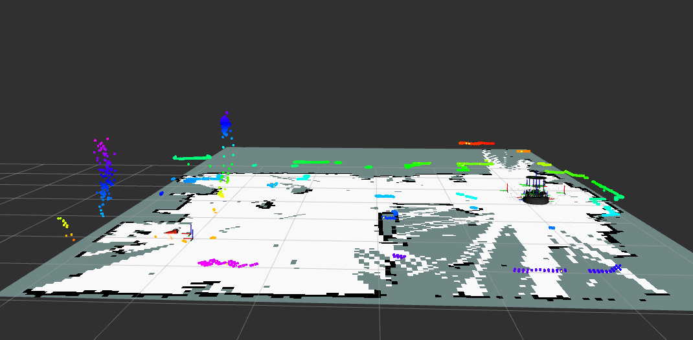

# Multi-Robot Visualization: Lab Handoff Guide

**Author**: Milan Bukovics  
**Institution**: University of Hawaiʻi at Mānoa — Dynamic Robotics Lab  
**Date**: May 2026

> **Mission**: Get Crazyflie drones and TurtleBot 4 ground robots showing up simultaneously in a
> single RViz2 window — live SLAM map, LIDAR point cloud, and 3D Multi-Ranger cloud — from one
> `ros2 launch` command, on physical hardware, with no external positioning system.

---

## 1. What This Project Is

### The goal

You want to walk into the lab, turn on a drone and a ground robot, run one command, and see both
of them moving in a shared 3D view in real time. The ground robot builds a map of the room as it
drives. The drone accumulates a sparse 3D point cloud of obstacles as it flies. Both appear in the
same coordinate frame so you can see how they relate spatially.

That's it. Simple to state, surprisingly not simple to implement.

### Why it took work

The Crazyflie 2.1 and the TurtleBot 4 were designed by different companies for different purposes.
They speak different protocols, make different assumptions about the software stack, and do not know
about each other. Bridging them requires resolving several layers of incompatibility simultaneously.

**Transport layer**: The Crazyflie communicates over a 2.4 GHz Crazyradio USB dongle using a
proprietary radio protocol. The TurtleBot communicates over Wi-Fi using DDS (the ROS 2 default).
These two channels don't interact — the `crazyflie_ros2` driver translates the radio protocol into
ROS 2 topics and services on the host computer, while the TurtleBot's topics arrive over the
network directly.

**Sensor modalities**: The Crazyflie carries a Multi-Ranger Deck with five fixed Time-of-Flight
sensors (one per direction: front, back, left, right, up). That gives you five range measurements
per scan — a deliberately sparse set designed for obstacle avoidance, not mapping. The TurtleBot
carries an RPLIDAR A1, a full 360° spinning LIDAR that produces hundreds of range measurements per
revolution. The two need different point cloud accumulation strategies and can't be handled by the
same node.

**Localization**: The Crazyflie localizes using its onboard Extended Kalman Filter, fusing optical
flow velocity estimates from the Flow Deck v2 with inertial measurements. It publishes its own
pose and TF transform directly — no SLAM, no map. The TurtleBot localizes via wheel odometry
corrected by SLAM (slam_toolbox), which builds an occupancy grid map of the environment and
corrects odometry drift using scan matching. These two robots produce position estimates through
entirely different mechanisms that need to be merged into a single coordinate system.

**TF frame conventions**: ROS 2 uses a transform tree (TF2) to track the position and orientation
of every frame of reference. Every sensor, every robot body, every map needs a chain of transforms
back to a common root frame (`world`). The Crazyflie driver publishes `world → cfb4` directly.
The TurtleBot's frame chain is longer: `world → tb{N}/map → odom → base_link → rplidar_link`.
Each link in that chain requires a different piece of infrastructure to maintain, and if any link
is missing, the entire pipeline silently fails.

### What success looks like

```
$ ros2 launch multi_robot unified_multi_robot.launch.py
```

RViz2 opens. You see:
- A grey occupancy grid (the SLAM map) growing as the TurtleBot drives
- A dense colored point cloud accumulating from the LIDAR
- A sparse point cloud appearing near the drone as the Multi-Ranger detects obstacles
- The TurtleBot body frame moving smoothly in the map

All of this continues until you Ctrl-C the launch. No manual commands needed after launch.

When SLAM is working, the combined view looks like this — the grey occupancy grid is the live map
being built, the colored point clusters are the accumulated LIDAR and Multi-Ranger point clouds:



---

## 2. System Architecture

### Hardware

**Crazyflie 2.1 (`cfb4`)** — 27 g open-source quadrotor, 92 mm motor-to-motor diagonal.

- **Flow Deck v2** (bottom mount): PAA3905 optical flow sensor (surface-relative horizontal
  velocity) + VL53L1x Time-of-Flight sensor (height above ground). Feeds the onboard Kalman
  filter. *Requires visible texture beneath the drone — see Pitfall P6.*
- **Multi-Ranger Deck** (top mount): five VL53L1x sensors pointing front/back/left/right/up,
  each up to ~4 m range. Published as `sensor_msgs/LaserScan` to `/{cf}/scan` at 10 Hz.
- **Crazyradio PA** USB dongle on the host computer bridges the radio link to ROS 2.

**TurtleBot 4 (`tb3`)** — differential-drive ground robot on iRobot Create3 base, Raspberry Pi 4
onboard compute.

- **RPLIDAR A1**: 360° planar LIDAR, ~12 m range, ~5.5 Hz scan rate. Published to `/{tb}/scan`.
- **Create3 base**: publishes wheel odometry to `/{tb}/odom` at ~62 Hz over Wi-Fi DDS.
- **OAK-D depth camera**: present on the robot but not yet integrated into this visualization.

### TF Frame Tree

Every sensor reading needs a chain of transforms back to `world` to be rendered in RViz2. Here is
the full tree for one active Crazyflie and one active TurtleBot:

```
world
├── cfb4                         ← crazyflie_ros2 (Kalman-filtered pose, 10 Hz)
│   └── cfb4/scan                ← Multi-Ranger sensor frame (5-ray LaserScan)
└── tb3/map                      ← static TF at world origin (anchors SLAM globally)
    └── odom                     ← slam_toolbox (SLAM-corrected drift, ~50 Hz TF)
        └── base_link            ← turtlebot_odom_tf_node (from wheel odometry, 62 Hz)
            └── rplidar_link     ← TurtleBot onboard driver (static sensor offset)
```

Every link must be present and publishing. The most common failure mode is a missing link — the
visualization just shows nothing, with no error.

### Data Flow

```
Crazyflie:
  Crazyradio PA → crazyflie_ros2 driver → /{cf}/scan + TF(world→cfb4)
    → multi_ranger_pointcloud_node → /{cf}/pointcloud → RViz2

TurtleBot:
  Wi-Fi DDS → /{tb}/scan + /{tb}/odom + /{tb}/tf
    → slam_toolbox → /{tb}/map + TF(tb3/map→odom)
    → turtlebot_odom_tf_node → TF(odom→base_link)
    → turtlebot_lidar_pointcloud_node → /{tb}/pointcloud → RViz2
```

Because the TurtleBot's onboard software publishes TF to `/{tb}/tf` and `/{tb}/tf_static` (not
to the global `/tf` topics), two `topic_tools relay` nodes forward those namespaced streams into
the global TF tree that RViz2 reads.

### Enabling / Disabling Robots

You don't edit Python code to change which robots are active. Edit the YAML files:

**`multi_robot_ws/src/multi_robot/config/turtlebots.yaml`**
```yaml
robots:
  tb0:
    enabled: false
    initial_position: [0.0, 0.0, 0.0]
  tb3:
    enabled: true       # ← only one TB at a time (see Pitfall P8)
    initial_position: [0.0, 0.0, 0.0]
```

**`multi_robot_ws/src/multi_robot/config/crazyflies.yaml`**
```yaml
robots:
  cfb4:
    enabled: true
    uri: radio://0/80/2M/E7E7E7E7B4   # must match the hardware sticker on your drone
    initial_position: [0.0, 0.5, 0.0]
```

Because the workspace was built with `--symlink-install`, these YAML files are symlinked
directly from source into the install tree. Changes take effect on the next launch with no rebuild.

### Custom Nodes (what was written for this project)

| Node | File | Purpose |
|------|------|---------|
| `crazyflie_path_node` | `crazyflie_path_node.py` | Arms drones, sends takeoff/hover/land sequence |
| `multi_ranger_pointcloud_node` | `multi_ranger_pointcloud_node.py` | Converts 5-ray LaserScan to growing world-frame PointCloud2 |
| `turtlebot_odom_tf_node` | `turtlebot_odom_tf_node.py` | Bridges odom topic → `odom → base_link` TF (Create3 doesn't do this itself) |
| `turtlebot_lidar_pointcloud_node` | `turtlebot_lidar_pointcloud_node.py` | Converts RPLIDAR LaserScan to growing world-frame PointCloud2 |
| `turtlebot_path_node` | `turtlebot_path_node.py` | Publishes rectangular cmd_vel path (autonomous driving test) |

All live in `multi_robot_ws/src/multi_robot/multi_robot/`.

### Config Files

| File | What It Controls |
|------|-----------------|
| `config/crazyflies.yaml` | Which CFs are active, radio URIs, initial positions, firmware logging |
| `config/turtlebots.yaml` | Which TBs are active, initial positions |
| `config/slam_toolbox.yaml` | SLAM solver settings, grid resolution, frame names |
| `config/motion_capture.yaml` | OptiTrack server IP and rigid body definitions (currently unused) |

---

## 3. How to Replicate This From Scratch

### 3.1 Prerequisites

**Operating system**: Ubuntu 24.04 with ROS 2 Jazzy desktop (`ros-jazzy-desktop`).

**Crazyflie stack** (separate from this repo):
- Python virtual environment at `/home/drl/Desktop/Crazyflies/venv/` with `cflib` installed
- `crazyflie_ros2` workspace built at `/home/drl/Desktop/Crazyflies/ros2_ws/`

**Additional apt packages** (install once):
```bash
sudo apt install \
  ros-jazzy-slam-toolbox \
  ros-jazzy-tf2-tools \
  ros-jazzy-topic-tools \
  ros-jazzy-nav2-lifecycle-manager \
  ros-jazzy-teleop-twist-keyboard
```

### 3.2 Workspace Sourcing — Do This Every Terminal, In This Order

```bash
source /opt/ros/jazzy/setup.bash
source /home/drl/Desktop/Crazyflies/ros2_ws/install/setup.bash
source /home/drl/multi_robot_RViz/multi_robot_visualization/multi_robot_ws/install/setup.bash
```

Order matters. Each `source` extends the environment built by the previous one. If you source
them out of order, or skip one, you'll get cryptic "package not found" or Python import errors
that don't tell you a workspace is missing.

A convenient alias to add to `~/.bashrc`:
```bash
alias srcrobots='source /opt/ros/jazzy/setup.bash && \
  source /home/drl/Desktop/Crazyflies/ros2_ws/install/setup.bash && \
  source /home/drl/multi_robot_RViz/multi_robot_visualization/multi_robot_ws/install/setup.bash'
```

### 3.3 Build the Workspace (First Time or After Code Changes)

```bash
cd /home/drl/multi_robot_RViz/multi_robot_visualization/multi_robot_ws
colcon build --symlink-install --packages-select multi_robot
source install/setup.bash
```

`--symlink-install` is important: it creates symlinks from `install/` to `src/` rather than
copying files. This means edits to Python nodes and YAML configs take effect immediately on the
next launch — no rebuild needed for config changes.

### 3.4 Enable the Robots You Have

Edit `config/turtlebots.yaml`: set `enabled: true` for the TurtleBot that is physically present
and connected to the lab Wi-Fi. All others should be `false`.

Edit `config/crazyflies.yaml`: set `enabled: true` for your Crazyflie. Check that the `uri`
matches the radio address printed on a sticker on your drone (format:
`radio://0/80/2M/E7E7E7E7B4`). Update `initial_position` if you're starting from a known
position.

### 3.5 Launch

Always run this from a **standard system terminal** (not the VSCode integrated terminal — see
Pitfall P7).

```bash
# Step 1: clean stale DDS shared memory (do this every session)
rm -rf /dev/shm/fastrtps_*

# Step 2: source workspaces (see 3.2)
srcrobots

# Step 3: launch
ros2 launch multi_robot unified_multi_robot.launch.py
```

RViz2 will open. Give it ~5–10 seconds for slam_toolbox to initialize and start publishing the
map. If anything looks wrong, check Section 4 before spending time debugging.

### 3.6 Verify It's Working

Open a second terminal, source workspaces, then run:

```bash
# Confirm topics exist
ros2 topic list | grep tb3        # expect /tb3/scan, /tb3/map, /tb3/pointcloud, /tb3/odom
ros2 topic list | grep cfb4       # expect /cfb4/scan, /cfb4/pointcloud, /cfb4/pose

# Confirm TF chain is complete
ros2 run tf2_tools view_frames    # writes frames.pdf — open it and verify the full tree

# Confirm slam_toolbox is active (not just unconfigured)
ros2 node info /tb3/slam_toolbox
# Should show subscriptions to /tb3/scan (among others)
# If it only shows /parameter_events, slam_toolbox is stuck unconfigured → see Pitfall P2
```

### 3.7 Driving the TurtleBot (Teleop)

In a third sourced terminal:

```bash
ros2 run teleop_twist_keyboard teleop_twist_keyboard \
  --ros-args \
  --remap cmd_vel:=/tb3/cmd_vel_unstamped \
  -p "qos_overrides./tb3/cmd_vel_unstamped.publisher.reliability:=best_effort"
```

Two things that will make you think this isn't working when it is:
1. **The terminal running this command must have active keyboard focus.** Click on it before
   pressing keys. The keys do nothing if focus is on another window.
2. **The QoS override flag syntax requires exact quotes.** The parameter name must be quoted
   as shown — `"qos_overrides./tb3/cmd_vel_unstamped.publisher.reliability:=best_effort"`.
   Without the override, the robot silently ignores all commands (see Pitfall P5).

---

## 4. Pitfalls and Non-Obvious Failures

Read this section before you spend time debugging. Every failure mode listed here is silent — no
useful error messages, no warnings. They look like the same symptom: "nothing is working."

---

### P1: Stale FastRTPS Shared Memory Files

**Symptom**: `ros2 topic list` hangs forever in a new terminal, or nodes on different terminals
can't see each other's topics.

**Cause**: FastRTPS (the default RMW) uses lock files in `/dev/shm/` for low-latency intra-host
communication. When a ROS 2 process is killed without clean shutdown (Ctrl-C, crash), its lock
files stay. After many sessions, hundreds accumulate. New processes try to attach to stale ports
and hang.

**Fix**: Before every launch session:
```bash
rm -rf /dev/shm/fastrtps_*
```

This is fast and safe to run even if no files exist. Make it a habit.

---

### P2: slam_toolbox Starts Unconfigured and Silent in ROS 2 Jazzy

**Symptom**: slam_toolbox appears in `ros2 node list`. No errors in the launch output. But there
is no `/tb3/map` topic, no `map → odom` TF, and the occupancy grid never appears in RViz2.

**Cause**: In ROS 2 Jazzy, `async_slam_toolbox_node` is a **managed lifecycle node**. It starts
in the "unconfigured" state with no active subscriptions or publishers. It does absolutely nothing
until it is driven through the `configure` and `activate` lifecycle transitions. This is a change
from older ROS 2 distributions (Humble, Foxy) where it started active automatically. The Jazzy
release notes and slam_toolbox docs do not prominently mention this.

**Diagnosis**:
```bash
ros2 node info /tb3/slam_toolbox
# If output shows only: Subscribers: /parameter_events
# → node is unconfigured. It should also show a subscriber to /tb3/scan.
```

**Fix**: A `nav2_lifecycle_manager` node is included in the launch file for each TurtleBot, with
`autostart: True` and `node_names: ['slam_toolbox']`. This automatically drives slam_toolbox
through configure → activate on launch. If you see this symptom, check that the lifecycle manager
is actually starting (it should appear in `ros2 node list` as `/tb3/lifecycle_manager`).

---

### P3: slam_toolbox `scan_topic` Parameter Is Ignored in a Namespace

**Symptom**: slam_toolbox activates correctly (has subscribers), but the SLAM map never grows and
no `map → odom` TF is published, even though `/tb3/scan` is publishing data.

**Cause**: When `async_slam_toolbox_node` runs inside a ROS 2 namespace (e.g., `/tb3`), the
`scan_topic` parameter — which is supposed to redirect which topic it subscribes to — is silently
ignored. The node subscribes to the absolute `/scan` topic regardless. Since `/scan` is never
published (only `/tb3/scan` is), slam_toolbox receives no data.

**Fix**: Instead of using the `scan_topic` parameter, use a DDS-layer **topic remapping** in the
Node() declaration:
```python
remappings=[('/scan', f'/{ns}/scan'),
            ('/map', f'/{ns}/map'),
            ('/map_metadata', f'/{ns}/map_metadata')]
```
Remappings are applied at the middleware transport layer before any node-internal parameter
resolution, making them robust to this kind of namespace-related parameter handling inconsistency.
This is already in `unified_multi_robot.launch.py`.

---

### P4: iRobot Create3 Does Not Publish `odom → base_link` TF

**Symptom**: TF chain stops at `odom` with no children. The LIDAR point cloud cannot be projected
into the world frame. slam_toolbox cannot localize.

**Cause**: The Create3 firmware publishes wheel odometry as `nav_msgs/Odometry` to `/{tb}/odom`
but does **not** publish the corresponding `odom → base_link` TF transform. The Create3 is
designed to be used with Nav2 AMCL, which manages that transform. Without Nav2, nothing publishes
it.

**Diagnosis**:
```bash
ros2 run tf2_tools view_frames
# If the chain ends at 'odom' with no children, this is the problem.

ros2 topic echo /tb3/odom
# Data should be arriving. The problem is not missing odometry — it's the missing TF.
```

**Fix**: `turtlebot_odom_tf_node.py` is a ~25-line node that subscribes to the odometry topic
and, on each message, rebroadcasts the contained pose as a `TransformStamped`. This is already
running as part of the launch. If you see this symptom, check that the node is in
`ros2 node list` as `/tb3/turtlebot_odom_tf_node`.

---

### P5: Teleop QoS Mismatch — Robot Ignores All Commands

**Symptom**: `teleop_twist_keyboard` is running. `/tb3/cmd_vel_unstamped` appears in
`ros2 topic list`. The robot does not move at all. No error messages anywhere.

**Cause**: `teleop_twist_keyboard` publishes with **RELIABLE** QoS (the ROS 2 default). The
Create3's command velocity subscriber uses **BEST_EFFORT** QoS. In DDS, a RELIABLE publisher and
a BEST_EFFORT subscriber are **incompatible** — messages are dropped at the transport layer with
no log entry, no warning, and no feedback to either node. The robot appears connected but receives
nothing.

**Diagnosis**:
```bash
ros2 topic info /tb3/cmd_vel_unstamped --verbose
# Look at RELIABILITY field under Publisher and Subscription.
# Publisher: RELIABLE, Subscription: BEST_EFFORT → mismatch → all messages dropped.
```

**Fix**: Downgrade the teleop publisher to BEST_EFFORT using the QoS override parameter shown in
Section 3.7. Do not omit the quotes around the parameter name — the shell requires them.

---

### P6: Optical Flow Sensor Fails on Black Lab Floor

**Symptom**: Crazyflie takes off but drifts uncontrollably. Position estimate in RViz2 wanders
far from the actual drone position. The drone may not hold altitude.

**Cause**: The Flow Deck v2's PAA3905 optical flow sensor measures horizontal velocity by
tracking surface features beneath the drone. The lab floor is uniform black tile. On a featureless
black surface the sensor sees no trackable features and outputs near-zero velocity readings
regardless of actual motion. The Kalman filter interprets this as the drone being stationary and
fails to correct accumulating drift.

**Fix**: Place a textured foam mat (or any surface with visible pattern contrast) under the
drone's takeoff position. The sensor only needs texture in a roughly 30 cm diameter area directly
below the drone at typical hover height.

---

### P7: VSCode Integrated Terminal Crashes RViz2

**Symptom**: RViz2 starts and immediately crashes, or crashes after a few seconds, with Qt
library errors in the terminal output. Launching from a plain terminal works fine.

**Cause**: VSCode on this machine is installed via snap. The snap environment injects snap's own
library paths into `LD_LIBRARY_PATH`, including snap versions of Qt libraries. When RViz2 links
against the system Qt, it finds the snap Qt first and crashes from library version mismatches.

The launch files include a `_clean_ld_library_path()` helper that strips snap paths before
launching RViz2, but this helper is applied inside the launch process — it doesn't help if you
start the launch itself from the polluted snap terminal.

**Fix**: Always run `ros2 launch` from a standard system terminal (GNOME Terminal, xterm, etc.).
Not the VSCode integrated terminal.

---

### P8: Only One TurtleBot Can Be Active at a Time

**Symptom**: Enabling two TurtleBots simultaneously causes the TF tree to behave erratically —
the SLAM map jumps, base_link position is inconsistent, and one or both robots' visualizations
are wrong.

**Cause**: Each TurtleBot's `turtlebot_odom_tf_node` instance publishes the transform
`odom → base_link` using those exact frame ID strings. With two robots both publishing to
`odom → base_link`, the two transforms overwrite each other in the global TF tree at 62 Hz each.
The result is that the TF tree alternates between the two robots' positions at high frequency.

**Fix (not yet implemented)**: `turtlebot_odom_tf_node.py` needs to accept a namespace parameter
and publish `{ns}/odom → {ns}/base_link` instead. The slam_toolbox `odom_frame` and `base_frame`
parameters in the launch file need to match. This is the primary open task on the
`multi-robot-support` branch.

**Current workaround**: Enable only one TurtleBot at a time in `turtlebots.yaml`.

---

## 5. Things That Were Tested and Don't Work

These are approaches that seemed reasonable and were tried, but failed. Knowing this saves you
from re-testing them.

**slam_toolbox `scan_topic` parameter for namespace redirection**: Documented as the way to
redirect which topic slam_toolbox subscribes to. Silently does nothing when the node runs in a
namespace. Use `remappings=` in the Node() declaration instead (see Pitfall P3).

**Multiple TurtleBots simultaneously with current code**: The frame ID collision in
`turtlebot_odom_tf_node` makes it impossible to run two TBs at once without the fix described in
Pitfall P8.

**`ros2 topic list` from the VSCode integrated terminal**: DDS discovery does not work correctly
from this terminal on this machine. The command either hangs or returns an empty list even when
nodes are running. Use a sourced standard system terminal.

**Launching without cleaning `/dev/shm/fastrtps_*`**: After multiple sessions, stale shared
memory files accumulate. Launching without cleaning them first produces intermittent DDS hangs
that look like random failures. Always clean before launching (see Pitfall P1).

**Optical flow on the plain black lab floor without a textured mat**: The drone drifts immediately
after takeoff and the position estimate is unusable. The foam mat is not optional.

**Getting Crazyflie global position without OptiTrack**: The onboard Kalman filter using optical
flow and IMU only provides a position estimate relative to the drone's own startup position, and
it drifts over time. Without OptiTrack, there is no way to place the Crazyflie at a known
absolute position in the room. This means the CF and TB point clouds share the same coordinate
frame by convention, but are not physically co-registered (see Section 6 for the fix).

---

## 6. What's Next — Where to Push From Here

The system works and has been demonstrated on hardware. Here is what's left to do, in rough order
of impact, with notes on what's already in place.

---

### 6.1 Multiple TurtleBots Simultaneously

**Branch**: `multi-robot-support` (already exists — start here)

**Why**: The current single-TB limitation is a code issue, not a hardware or ROS 2 limitation.
All the infrastructure for multi-TB already exists in the launch loop; it just needs the frame ID
fix.

**What to change**:

1. In `turtlebot_odom_tf_node.py`, add a `robot_namespace` parameter:
```python
self.declare_parameter('robot_namespace', '')
ns = self.get_parameter('robot_namespace').get_parameter_value().string_value
# Then publish:  {ns}/odom → {ns}/base_link  instead of  odom → base_link
```

2. In `unified_multi_robot.launch.py`, pass the namespace when launching the node:
```python
Node(
    package='multi_robot',
    executable='turtlebot_odom_tf_node',
    namespace=ns,
    parameters=[{'robot_namespace': ns}],
    ...
)
```

3. Update the slam_toolbox parameters for each robot in the launch:
```python
parameters=[{'odom_frame': f'{ns}/odom',
             'base_frame': f'{ns}/base_link',
             'map_frame': f'{ns}/map'}]
```

**Verification**: Enable tb2 and tb3 in `turtlebots.yaml`, launch, confirm both SLAM maps appear
independently and both robots can be driven via teleop.

---

### 6.2 OptiTrack Integration for Spatial Alignment

**Why**: Right now the Crazyflie and TurtleBot each treat their physical startup location as
`(0, 0, 0)` in the world frame. Their coordinate origins are independent. In RViz2 this means
the CF point cloud and TB SLAM map are co-located by convention but not by physics — a drone
flying 2 meters north of the TurtleBot appears at `(0, 0, 0)` relative to its own origin, which
may be anywhere in the TB's map. The two clouds are in the same RViz2 window but not spatially
meaningful relative to each other.

**What's already in place**: `config/motion_capture.yaml` has the OptiTrack server IP address and
rigid body marker layout for the Crazyflie already configured. No hardware setup is needed.

**What to change**:

In `config/crazyflies.yaml`, change:
```yaml
tracking: "none"
```
to:
```yaml
tracking: "optitrack"
```

With OptiTrack active, `crazyflie_ros2` replaces the Kalman filter's optical flow estimate with
millimeter-precision absolute position from the motion capture system, expressed in OptiTrack's
global frame. If the OptiTrack origin is set to match the TurtleBot's SLAM map origin (both at
the same physical corner of the room, for example), the CF pose and TB SLAM map become physically
co-registered.

**Note**: The TurtleBot's SLAM origin is wherever it was physically located at launch time (that's
`(0, 0, 0)` in its map frame). The OptiTrack origin is defined by the camera calibration. For the
two to align, you either define the OptiTrack origin at the TurtleBot's launch position, or you
initialize the TurtleBot at a known OptiTrack coordinate.

---

### 6.3 Nav2 Autonomous Navigation

**Why**: The TurtleBot currently requires manual keyboard control. Nav2 enables goal-pose
autonomous navigation using the SLAM map that's already being built.

**What's already in place**: The slam_toolbox output — an `nav_msgs/OccupancyGrid` on
`/{tb}/map` and the full TF chain — is exactly what Nav2 needs as input. No changes to the
existing SLAM or TF configuration are required.

**What to add**:
- `nav2_bringup` launch included in the per-TB loop with the existing map topic remapped
- A `nav2_params.yaml` config file specifying the costmap, planner, and controller settings
- An RViz2 Nav2 plugin panel for sending goal poses interactively

This is a well-documented path — the Nav2 getting-started guide at nav2.org covers exactly this
configuration starting from a slam_toolbox map.

---

### 6.4 Denser Aerial Mapping

**Why**: The Multi-Ranger Deck's five fixed rays are too geometrically sparse for SLAM loop
closure. There is insufficient scan overlap between successive drone positions to compute a
reliable scan-match constraint. The accumulated point cloud is useful as a qualitative obstacle
indicator but does not contribute to a persistent map.

**Options**:
- **Miniature spinning LIDAR** on the CF (e.g., SLAMTEC RPLIDAR C1 mini): would provide 360°
  sweep geometry compatible with slam_toolbox. Weight and power budget are the constraints.
- **Depth camera** (Intel RealSense D435i or similar): provides dense 3D point clouds but
  requires more onboard compute and careful calibration.

Either addition would allow `async_slam_toolbox_node` to run on the aerial platform, making the
Crazyflie a first-class mapping contributor alongside the TurtleBot.

---

## Appendix: Quick Reference Commands

```bash
# Source all workspaces
source /opt/ros/jazzy/setup.bash
source /home/drl/Desktop/Crazyflies/ros2_ws/install/setup.bash
source /home/drl/multi_robot_RViz/multi_robot_visualization/multi_robot_ws/install/setup.bash

# Pre-launch cleanup (always do this)
rm -rf /dev/shm/fastrtps_*

# Build (only needed after Python code changes)
cd /home/drl/multi_robot_RViz/multi_robot_visualization/multi_robot_ws
colcon build --symlink-install --packages-select multi_robot && source install/setup.bash

# Launch everything
ros2 launch multi_robot unified_multi_robot.launch.py

# Verify topics
ros2 topic list | grep tb3
ros2 topic list | grep cfb4

# Check TF chain
ros2 run tf2_tools view_frames        # → frames.pdf

# Check slam_toolbox lifecycle state
ros2 node info /tb3/slam_toolbox      # should have scan subscriber if active

# Teleop (tb3)
ros2 run teleop_twist_keyboard teleop_twist_keyboard \
  --ros-args \
  --remap cmd_vel:=/tb3/cmd_vel_unstamped \
  -p "qos_overrides./tb3/cmd_vel_unstamped.publisher.reliability:=best_effort"

# Inspect QoS profiles on a topic
ros2 topic info /tb3/cmd_vel_unstamped --verbose
```
